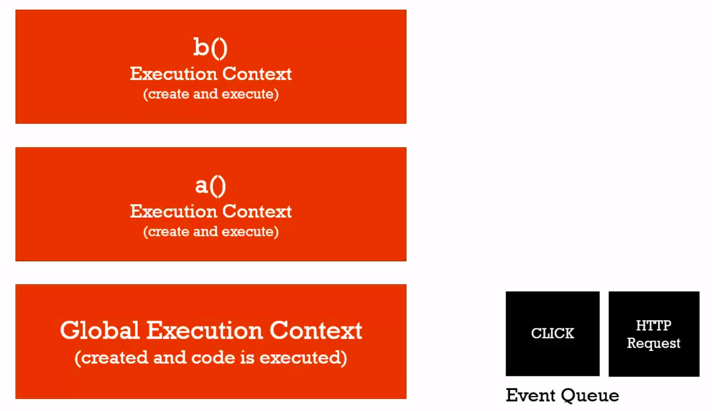
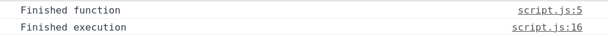
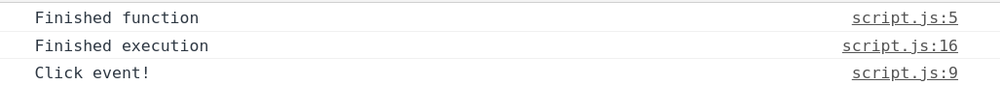

# 關於非同步回呼(What About Asynchronous Callbacks?)

* 非同步：表示在一個時間點，可能有一段程式在執行時會開始執行另一段程式碼，然後又會再執行別的程式碼。這些程式碼在JavaScript引擎內是同時在執行的。

1. 對於`JavaScript引擎`，我們知道它是`同步執行`的，即之前提到的執行堆(Stack)由上至下執行。而如果出現事件如`click`，`HTTP REQUEST`等等，此事件並不會被放入至執行堆，而是放入`事件儜列(Event Queue)`，等執行堆中的變數或函數執行完畢，才行執行此事件儜列(Event Queue)。注意，處理事件的順序也是按發生的順序，因此`JavaScript總是用同步執行的方式處理非同步`。
2. 簡單來說，`只有JavaScript引擎是同步的`。而當有非同步事件的請求，例如瀏覽器的其他部分在執行時，此時JavaScript程式仍在執行，這就出現了非同步回呼。

<br><br>

下圖的左方是Stack,優先執行，而右方即爲Event Queue，等Stack由上至下執行完畢之後才會被順序執行。

<br><br>

例子1：

* 我們不進行click的點擊，而是直接等待3秒。

```javascript
// long running function
function waitThreeSeconds() {
    let ms = 3000 + new Date().getTime();
    while(new Date() < ms){}
    console.log("Finished function");
}

function clickHandler() {
    console.log("Click event!");
}

// listen for the click event
document.addEventListener('click', clickHandler);

waitThreeSeconds();
console.log("Finished execution");
```

結果：



<br><br>

例子2：

* 我們不等待waitThreeSeconds函數中3秒，而是在3秒內點擊，看看click事情是否會優先出發。

```javascript
// long running function
function waitThreeSeconds() {
    let ms = 3000 + new Date().getTime();
    while(new Date() < ms){}
    console.log("Finished function");
}

function clickHandler() {
    console.log("Click event!");
}

// listen for the click event
document.addEventListener('click', clickHandler);

waitThreeSeconds();
console.log("Finished execution");
```

結果：



從結果中我們可以看到click事件是在最後才被打印出來，這是因爲必須先執行完Stack裏的變數與函數，才執行Event Queue。