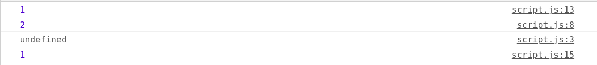

# 函數、環境與變數環境(Functions, Context, and Variable Environments)

1. 位於全域的變數是與全域執行環境的變數環境有關，因此函數的位置並不會影響到此定義變數的結果。
2. 而位於函數裏的變數就是與函數的執行環境有關。

例子：
```javascript
function b() {
    let myVar;
    console.log(myVar);
}

function a() {
    let myVar = 2;
    console.log(myVar);
    b();
}

let myVar = 1;
console.log(myVar);
a();
console.log(myVar);
```
結果：

<br>
