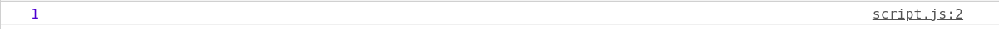
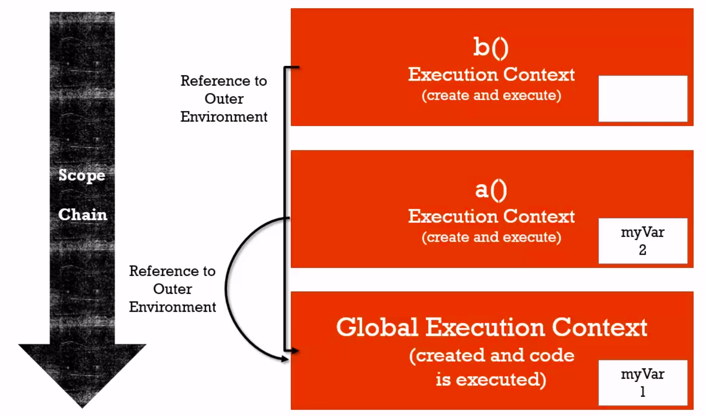
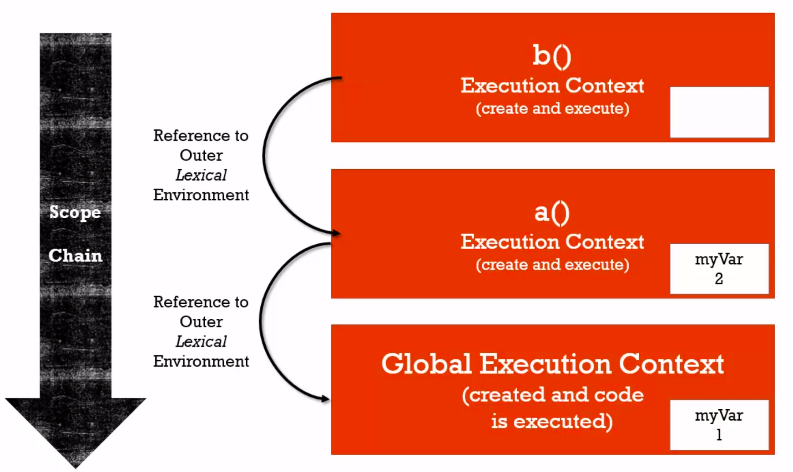

# 範圍鏈(The Scope Chain)

1. `範圍(Scope)`:代表我能夠取用這個變數的地方。`(鏈)Chain`:外部環境參照的連結。
2. 每一個執行環境都有一個參照到它的外部環境(Outer environment)
3. 當你需要某個執行環境內的程式碼的變數，如果它無法找到變數，它會到外部環境尋找變數(在執行堆正下方的地方)。另外，對於它所指的外部環境，會依據函數實際上的位置而有所不同

例子1：

```javascript
function b() {
    console.log(myVar);
}

function a() {
    let myVar = 2;
    b();
}

let myVar = 1;
a();
```
結果：




對於以上的`b函數`，它的`外部環境`中存在的變數是`myVar = 1`。這個例子中的b函數實際上不在a函數裏，而是位於全域等級最外層的地方，所以它的外部環境(outer environment)，外部詞彙環境(lexical environment)都是全域的。



<br><br><br>

例子2：

```javascript
function a() {

    function b() {
        console.log(myVar);
    }

    let myVar = 2;
    b();
}

let myVar = 1;
a();
```
結果：


在這個例子中，b函數的外部環境是a函數裏，因此它所需要的變數會從a函數的環境裏尋找，即爲2。



<br><br><br>

例子3：

```javascript
function a() {

    function b() {
        console.log(myVar);
    }

    b();
}

let myVar = 1;
a();
```
結果：


因爲a函數爲b函數的外部環境，b函數首先會從a函數環境裏尋找變數的值。如果在a函數環境裏找不到所需的值，就會從a函數環境的外部環境進行尋找，即全域環境(Global Environment)。這是一個遞進的順序，符合stack的規律。

`注意`：b函數在創造階段被未被寫入記憶體中，因爲它只是當a被呼叫時才被建立。
