<h1 align="center">
<br>
  <a href="#"></a>
  <br>
    <br>
  JavaScript 進階概念
  <br>
</h1>

## 簡介

這個指南是幫助開發者理清JavaScript中一些奇怪的概念，它是高級JavaScript開發者的必備知識。

> 部分概念來源於@Anthony Alicea

---

## 更新

每天更新一個新的概念，如有發現錯誤，請聯繫我更改或刪除。

---

## 執行環境與詞彙環境

<h4><a href="#1">全域環境與全域物件</a></h4>
<h4><a href="#2">執行環境：創造與提升</a></h4>
<h4><a href="#3">JavaScript與undefined</a></h4>
<h4><a href="#4">執行環境：程序執行</a></h4>
<h4><a href="#5">單執行緒、同步執行</a></h4>
<h4><a href="#6">函數呼叫與執行堆</a></h4>
<h4><a href="#7">函數、環境與變數環境</a></h4>
<h4><a href="#8">範圍鏈</a></h4>
<h4><a href="#9">範圍、ES6餘let</a></h4>
<h4><a href="#10">關於非同步回呼</a></h4>

<br><br>

<h2 id="1">全域環境與全域物件 (The Global Environment and The Global Object)</h2>

1. 在執行空的JavaScript文件時，即使在開發者工具中沒有任何東西顯示，但實際上它已經爲開發者創造了全域的環境，全域物件以及特殊變數「this」（此時，window = this = Global Object, 在開發者工具中輸入這兩個值所返回的結果是相同的）。
2. 注意，當我們說「Global」的時候，實際上表達的是「Codes or Variables Are Not Inside a Function」。
3. 注意，如果在全域範圍使用`let`宣告變數，此變數並不會成爲全域物件的特性（即使使用者可以在開發中工具中直接輸入它的值並返回，但它不存在於全域中）。
4. 在函數內使用`var`宣告變數，而在函數外部同樣使用`var`宣告相同命名的變數時，會導致洩露到全域中，即區域變數覆蓋全域變數。
5. 因此開發者應該儘量避免使用`var`,而用`let`與`const`替代。
6. `let`所宣告的變數，在全局環境中不能相同，在區域環境內也不能相同，`即在同一個環境中都不能相同。`但區域環境與全局環境的變數命名可以相同。例如在全局環境定義`let price = 10;`，在區域環境也可以定義`let price = 20;`

讓我們來看一個例子：

```javascript
var a = 10;
let b = "John";

function test() {
    var c = 5;
}
```

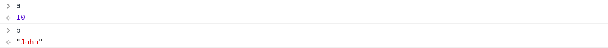
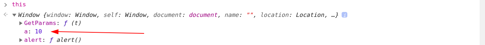
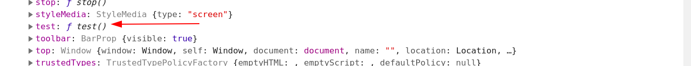

當嘗試在開發者工具輸入c的時候，會顯示「c is not defined」，因爲它是區域函數。
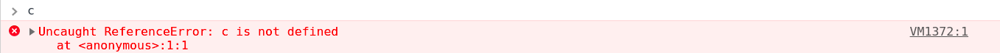

讓我們再看看`var`變數洩露的例子：

```javascript
var price = 40;

if(true) {
    var price = 30;
}

console.log(price);
```
上述出現的結果爲30，區域變數覆蓋全域變數。

```javascript
for (var i = 0; i<10 ; i++) {
      …
}
console.log(i)
```
上述出現的結果爲10，循環變數洩漏為全域變數。

<br>

接下來，讓我們來看看`let`的例子：
```javascript
let price = 40;

if(true) {
    let price = 30;
}

console.log(price);
```
上述出現的結果爲40，沒有發生洩露。

<br><br>

<h2 id="2">執行環境：創造與提升 (Creation and Hoisting)</h2>

1. 在逐行執行代碼之前，JavaScript已經爲`變數和函數在記憶體中建立了空間`。
2. 我們寫的程式碼不會直接被執行，而是會經過JavaScript的轉換。在第一個創造執行環境的階段(creation phrase)，它會在記憶體中空出空間給變數和函數。因此在它們實際出現在詞彙環境(lexical environment)裡面之前，我們可以有限的取用它們。
3. 所有`JavaScript的變數`一開始都會被設定爲`undefined`，`函數`則是完全被設定好放進`記憶體(Memory)`中

首先我們來看看函數的例子：
```javascript
a();

function a() {
    console.log('Hello World');
}
```
```javascript
function a() {
    console.log('Hello World');
}

a();
```
以上兩個例子出現的結果是一樣的，都會打印出「Hello World」。但儘量避免使用這種「hoisting」，否則容易掉入陷阱。

接著我們再看看變數（使用`var`）的例子：
```javascript
console.log(a);
var a = 10;
```
這出現的結果爲「undefined」，實際上它與下面的程式碼相似：
```javascript
var a;
console.log(a);
a = 10;
```

但如果我們使用`let`來宣告函數，則會出現不一樣的結果：
```javascript
console.log(a);
let a = 10;
```


因此，這就是使用`let`的好處，一是可以避免依賴「hoisting」，二是防止掉入陷阱。

<br><br>

<h2 id="3">JavaScript與undefined (JavaScript and 'undefined')</h2>

1. `undefined`是在第一階段即創造階段被設定的值，此時會產生執行環境，把變數放進記憶體(Memory)中,並將變數設爲undefined。
2. `undefined` 不代表`空的(empty)`或者`還沒定義(doesn't exist)`，它是一個`特殊的關鍵值值(special key word)`，並且會`佔據記憶體空間`。意思爲這是JavaScript設定的初始值。
3. 注意：永遠不要將變數直接設置成undefined，這是非常危險的。例如 `a = undefined;`。（因爲如果這樣做會分不清是你自己設置成undefined或是JavaScript自身幫你設置）最好的做法是讓undefined表示我從未設定該值，例如 `var a;`

現在讓我們來看例子（沒有給a賦值）：
```javascript
let a; // use 'var' is the same
console.log(a);

if (a === undefined) {
    console.log("a is undefined!");
} else {
    console.log("a is defined!");
}
```
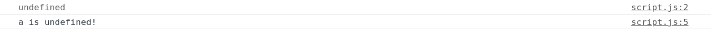<br><br>

接著讓我們看看賦值的例子（給a賦值）：
```javascript
let a = "Hello World!"; // use 'var' is the same
console.log(a);

if (a === undefined) {
    console.log("a is undefined!");
} else {
    console.log("a is defined!");
}
```
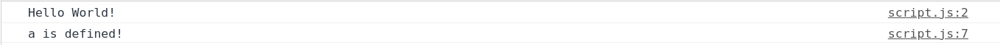<br><br>

再看看沒有宣告變數的例子：
```javascript
console.log(a);

if (a === undefined) {
    console.log("a is undefined!");
} else {
    console.log("a is defined!");
}
```
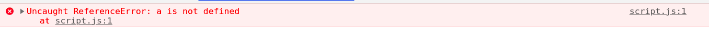
這出現的原因是在創造階段中，沒有找到`var a;`或`let a;`，所以它從未出現在記憶體中，因此出現了`Uncaught ReferenceError: a in not defined`。

<br><br>

最後，如果我們直接設置undefined，這是非常危險和困擾的，來看看例子：
```javascript
let a = "Hello World"; // use 'var' is the same
console.log(a);

a = undefined; // don't use like this way

if (a === undefined) {
    console.log("a is undefined!");
} else {
    console.log("a is defined!");
}
```
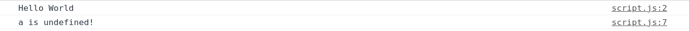
我們可以看到，此時結果a有值爲「Hello World」，又爲undefined，這是不是非常容易產生誤解？

<br><br>

<h2 id="4">執行環境：程序執行 (The Execution Context - Code Execution)</h2>

1. 提醒：在`創造階段`，已經設定好了`Global Object`, `'this'` 和`Outer Environment`。之後就進入`執行階段`逐行對代碼進行編譯和轉換。

現在讓我們來看看例子：
```javascript
// We cannot use 'let' to do like this way, 
// it will show Uncaught ReferenceError: Cannot access 'a' before initialization

console.log(a);

var a = "Hello World"; 
                        
console.log(a);
```
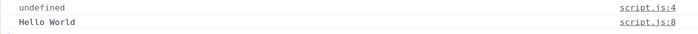
因爲a在創造階段被設爲undefined，所以上方會打印出undefined。然後在執行階段把記憶體中的a值設定爲"Hello World"字串，之後就在下方那一行將a在記憶體中的值輸出至console。

<br><br>

<h2 id="5">單執行緒、同步執行 (Single Threaded, Synchronous Execution)</h2>

1. 單執行緒(Single Threaded): `一次只執行一個指令`(One command at time)
2. 同步執行(Synchronous Execution): `程式碼會依照出現的順序一次執行一行`(One at time)

<br><br>

<h2 id="6">函數呼叫與執行堆 (Function Invocation and the Execution Stack)</h2>

1. Function Invocation -> Call function
2. Execution Stack -> 位於執行堆最上面的先執行，執行完之後丟棄，進而執行下一層

讓我們來看看例子：
```javascript
function a() {
    b();
    console.log("I'm a function");
    let c;
}

function b() {
    console.log("I'm b function");
    let d;
}

a();
let d;
```
首先會呼叫a函數，再執行a函數裏的b函數（我們可以看到下圖的b函數位於stack的最上層），此時跳過`let c`，這是因爲單執行緒與同步執行。在b函數裏，首先會打印出「I'm b function」，再執行`let b`。執行完b函數裏所有行數之後就回到a函數裏，執行下一行，打印「I'm a function」,以此類推。最後當a和b函數都執行完畢之後，stack堆只剩下Global Excution Context，在這個環境中僅剩`let d`，最後就執行它。參考下圖：

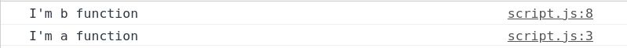<br>

Step1:
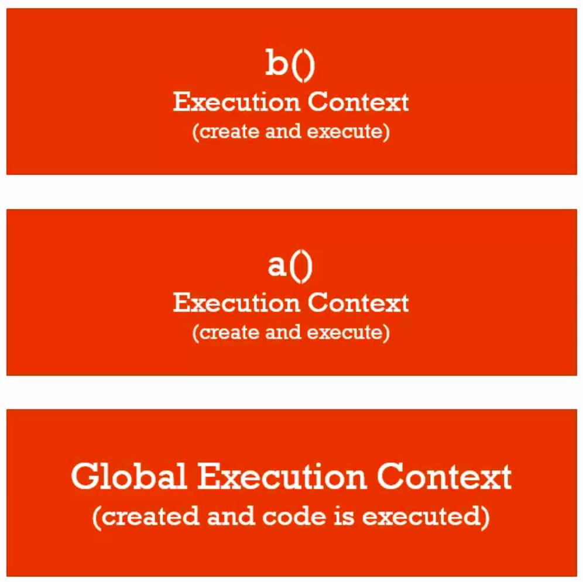<br>

Step2:
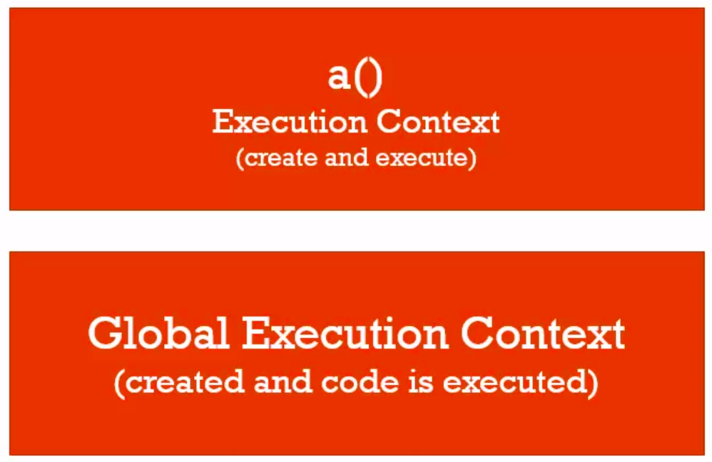<br>

Step3:
<br>


